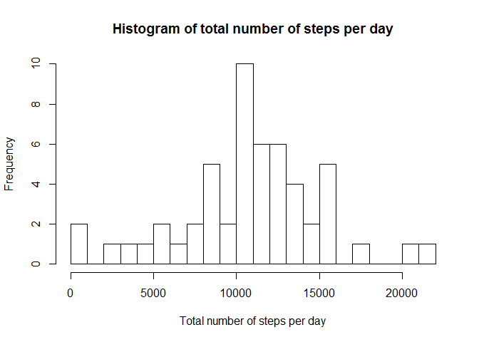
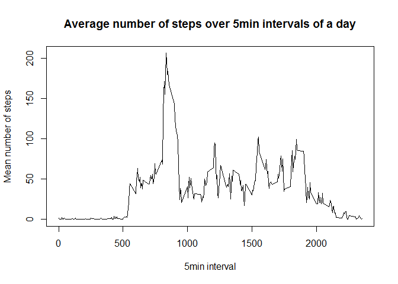
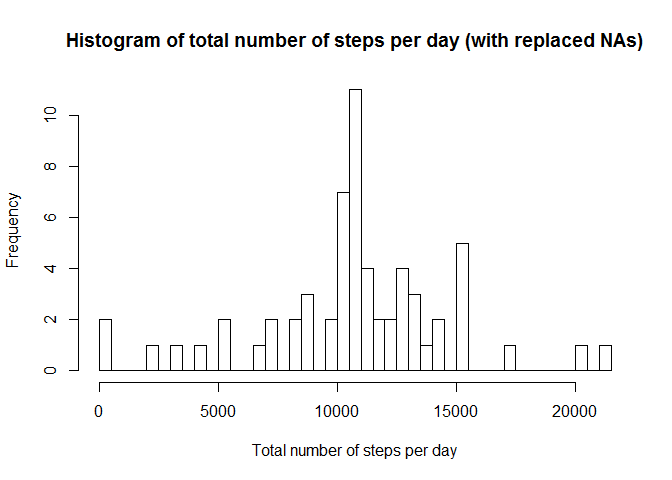
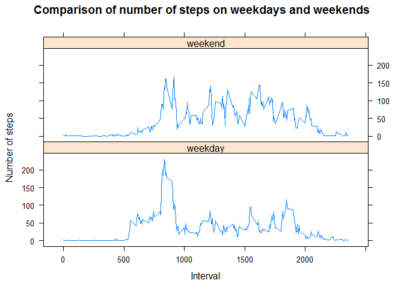

# Reproducible Research: Peer Assessment 1


<!--- ============================================================================= --->
## Loading and preprocessing the data

To load the data from the .csv file (which is located in a subfolder `activity/`) into a variable `rawdata`, the following command is used:


```r
rawdata <- read.csv("activity/activity.csv")
```

After loading the data, it has to be prepared for the following analyses by removing the NA values from the data:


```r
procdata <- rawdata[!is.na(rawdata["steps"]),]
```


<!--- ============================================================================= --->
## What is mean total number of steps taken per day?

As a basis for the calculation of mean and median, the sum of steps for each day is calculated by aggregating values obtained on the same day:


```r
totalNumberStepsPerDay <- aggregate(procdata$steps, by=list(procdata$date), FUN=sum)
```

A histogram of can be plotted using he hist function:


```r
names(totalNumberStepsPerDay) <- c("Date", "Steps_total")
hist(totalNumberStepsPerDay$Steps_total, breaks=40, main="Histogram of total number of steps per day", xlab="Total number of steps per day")
```

 


The mean and median of the total number of steps are calculated:


```r
meanStepsIgnoredNAs <- mean(totalNumberStepsPerDay$Steps_total)
medianStepsIgnoredNAs <- median(totalNumberStepsPerDay$Steps_total)
```

And the results are as follows:


```r
meanStepsIgnoredNAs
```

```
## [1] 10766.19
```

```r
medianStepsIgnoredNAs
```

```
## [1] 10765
```


<!--- ============================================================================= --->
## What is the average daily activity pattern?

To analyze the daily activity pattern, we first have to calculate the average on all 5min periods:


```r
fiveMinAvg <- aggregate(procdata$steps, by=list(procdata$interval), FUN=mean)
```

Now we plot these averages as a time series:


```r
names(fiveMinAvg) <- c("interval", "steps_avg")
plot(fiveMinAvg, type="l", xlab="5min interval", ylab="Mean number of steps", main="Average number of steps over 5min intervals of a day")
```

 

The maximum number of steps (on average) of a whole day falls into the following 5min interval (found by selecting the entry with the maximum number of average steps, and printing the number of steps from this line):


```r
fiveMinAvg[which.max(fiveMinAvg$steps_avg),][1,1]
```

```
## [1] 835
```


<!--- ============================================================================= --->
## Inputing missing values

The number of rows with missing values in the data set is:


```r
length(rawdata[is.na(rawdata["steps"]),]$steps)
```

```
## [1] 2304
```


To fill in the missing values, I chose the strategy to replace the NA values with the mean of the missing time interval over all days. The filled data set is therefore calculated like this:

1) First calculate means for all five minute periods:


```r
fiveMinMean <- aggregate(procdata$steps, by=list(procdata$interval), FUN=mean)
names(fiveMinMean) <- c("interval", "steps_mean")
```


2) Replace each NA with the median of the respective 5min period:


```r
filleddata <- rawdata
for (i in 1:nrow(filleddata)){
  if (is.na(filleddata[i, "steps"])){
    filleddata[i, "steps"] <- fiveMinMean[fiveMinMean[,"interval"]==filleddata[i, "interval"], "steps_mean"]
  }
}
```


### Redo of total number of steps analysis steps

To compare this new data with replaced NAs with the previously used data, the calculations and steps from previously have to be repeated using the new data.


First, calculate the sum of steps for each day and plot it as a histogram:


```r
totalNumberStepsPerDayReplNa <- aggregate(filleddata$steps, by=list(filleddata$date), FUN=sum)
names(totalNumberStepsPerDayReplNa) <- c("Date", "Steps_total")
hist(totalNumberStepsPerDayReplNa$Steps_total, breaks=40, main="Histogram of total number of steps per day (with replaced NAs)", xlab="Total number of steps per day")
```

 


The mean and median of the total number of steps are calculated:


```r
meanStepsReplacedNAs <- mean(totalNumberStepsPerDayReplNa$Steps_total)
medianStepsReplacedNAs <- median(totalNumberStepsPerDayReplNa$Steps_total)
```

And the results are as follows:


```r
meanStepsReplacedNAs
```

```
## [1] 10766.19
```

```r
medianStepsReplacedNAs
```

```
## [1] 10766.19
```


### Comparison of results with ignored NAs and replaced NAs

Comparison of both means:


```r
stepMeans <- c(meanStepsIgnoredNAs, meanStepsReplacedNAs)
names(stepMeans) <- c("Ignore_NAs", "Replaced_NAs")
stepMeans
```

```
##   Ignore_NAs Replaced_NAs 
##     10766.19     10766.19
```

And the same for the medians:


```r
stepMedians <- c(medianStepsIgnoredNAs, medianStepsReplacedNAs)
names(stepMedians) <- c("Ignore_NAs", "Replaced_NAs")
stepMedians
```

```
##   Ignore_NAs Replaced_NAs 
##     10765.00     10766.19
```

As these numbers show, there is not much difference whether one *does* ignore the NA values or one *replaces* them with the mean of the respective interval of the day.


## Are there differences in activity patterns between weekdays and weekends?

To analyze the differences in the activity patterns of weekdays and weekends, we first need an additional factor variable to differentiate between those days:


```r
dataWithDay <- cbind(filleddata, weekdays(as.POSIXct(filleddata$date)))
levels(dataWithDay[,4]) <- c("weekday", "weekday","weekday", "weekday","weekday", "weekend", "weekend")
names(dataWithDay)[4] <- "weekday?"
```


Using this new variable, we can now aggregate the steps in each five minute interval, once for weekdays and once for weekends (and adding a column again holding the factor 'weekday' or 'weekend'):


```r
fiveMinAvgWeekday <- cbind(aggregate(dataWithDay[dataWithDay$`weekday?`=="weekday",]$steps, by=list(dataWithDay[dataWithDay$`weekday?`=="weekday",]$interval), FUN=mean), "weekday")
names(fiveMinAvgWeekday) <- c("interval", "steps_avg", "day")

fiveMinAvgWeekend <- cbind(aggregate(dataWithDay[dataWithDay$`weekday?`=="weekend",]$steps, by=list(dataWithDay[dataWithDay$`weekday?`=="weekend",]$interval), FUN=mean), "weekend")
names(fiveMinAvgWeekend) <- c("interval", "steps_avg", "day")
```


Finally, both aggregated data sets can be plotted as time series by first combining them into a single data set, and then plotting this data set using the lattice library, conditioned on the weekday:


```r
fiveMinAvgComp <- rbind(fiveMinAvgWeekday, fiveMinAvgWeekend)
names(fiveMinAvgComp) <- c("interval", "steps_avg", "day")

day.f <- factor(fiveMinAvgComp$day,levels=c("weekday", "weekend"))

library(lattice)
xyplot(fiveMinAvgComp[,2]~fiveMinAvgComp[,1] |day.f, main="Comparison of number of steps on weekdays and weekends", xlab="Interval", ylab="Number of steps", type="l", layout=c(1,2))
```

 

